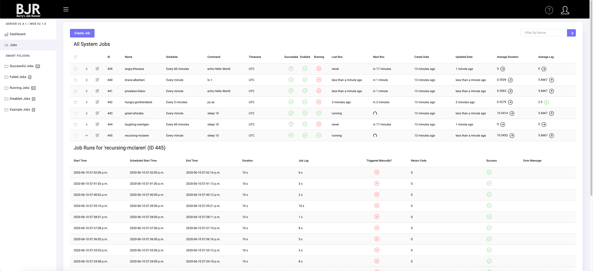

      ____      _ ____   __        __   _
     | __ )    | |  _ \  \ \      / /__| |__
     |  _ \ _  | | |_) |  \ \ /\ / / _ \ '_ \
     | |_) | |_| |  _ <    \ V  V /  __/ |_) |
     |____/ \___/|_| \_\    \_/\_/ \___|_.__/

                Barry's Job Runner

  

#### Introduction

This is the web UI component of the BJR server (https://github.com/barryw/bjr). It allows you to manage your job server visually, instead of using BJR's REST API.

